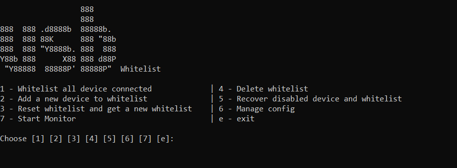

# USB Whitelist Windows

This project monitors and manages USB device connections on a Windows computer. It can whitelist USB devices, block unapproved devices, log USB activities, and lock the workstation when unapproved devices are connected.



## Features

- **Whitelist Management**: Whitelist all connected devices, add new devices to the whitelist, and reset or clear the whitelist.
- **USB Device Monitoring**: Detect and handle USB device connections and disconnections.
- **Device Blocking**: Disable unapproved USB devices.
- **Workstation Locking**: Lock the workstation when an unapproved USB device is connected.
- **Logging**: Log details of USB device activities including vendor ID, product ID, manufacturer, product name, serial number, USB version, device class, and configuration.

## Requirements

- Windows OS
- Python 3.12
- PyUSB
- pywin32
- libusb

## Installation

1. Clone this repository to your local machine.
2. Lunch manager and follow the steps, the requirements will be installed:
   
    ````
    python usb-whitelist-manager.py
4. Libusb backend is pre-installed.

## Configuration

The configuration file `settings.conf` is located in the `config` directory. You can manage the configuration using the built-in configuration manager.

## Usage

```
python usb-whitelist-manager.py
```
